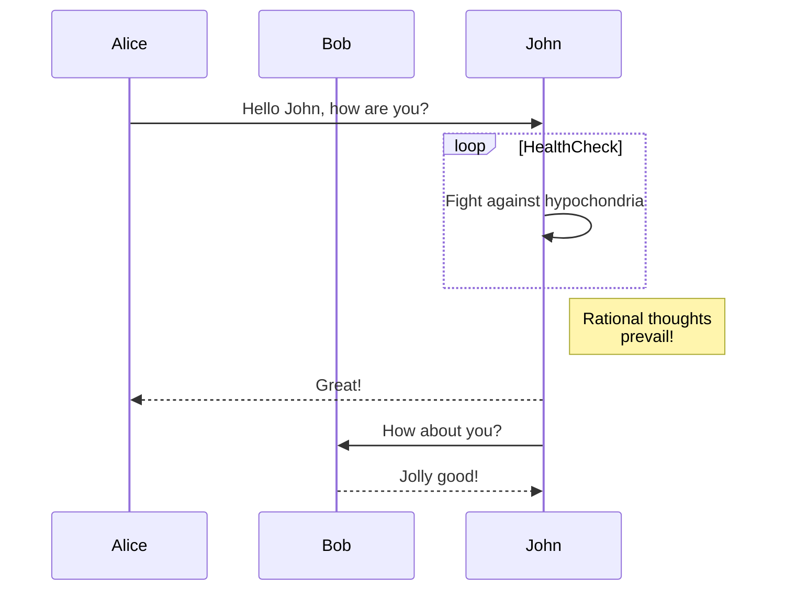

@[figma](https://www.figma.com/files/team/1440146361004093722/drafts?fuid=1440146359211881782)

```mermaid
    sequenceDiagram
        participant Alice
        participant Bob
        Alice->>John: Hello John, how are you?
        loop HealthCheck
            John->>John: Fight against hypochondria
        end
        Note right of John: Rational thoughts <br/>prevail!
        John-->>Alice: Great!
        John->>Bob: How about you?
        Bob-->>John: Jolly good!
```

```mermaid
    graph TD;
        A-->B;
        A-->C;
        B-->D;
        C-->D;

```